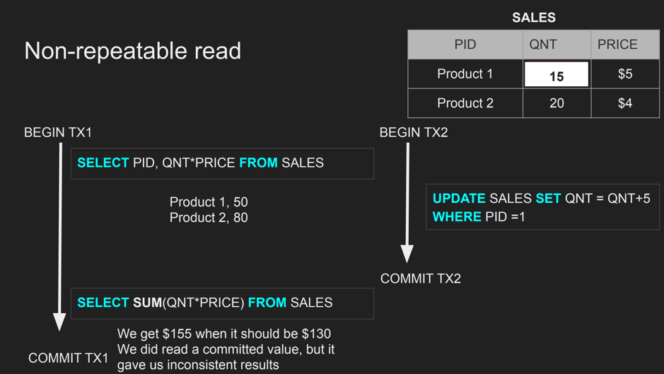

# Isolation

* Can my inflight transaction can see changes made by the other
inflight transaction?
* Read phenomena
* Isolation levels

## Isolation - Read Phenomena
* Dirty Read
  * The write is not yet commited
* Non - repeatable reads
* Phantom reads
  * Range based queries
* Lost updates

### Dirty Reads
* Example:
  * 

### Non Repeatable Read
* Example
  * 
### Phantom Reads
* This is different from above as this is insert not update
* Example
  * 

### Lost Update:
  * 

## Isolation levels

### Read Uncommitted
* Is like no isolation
* Any change from outside is visible to the transaction committed or not.
* We can get dirty reads
* Technically fast, could be not

### Read Committed
Each query in a transaction sees only the committed changes by other 
transactions.

### Repeated Reads
The transaction will make sure that when a query reads a row, that row will
remain unchanged the while it is running.

### Snapshot
Every query in a transaction sees only changes that have been committed up to
the start of the transaction. It's like a snapshot version of entire DB at that 
moment.

### Serializable
The transactions are run as if they serialized one after the other.

> Each DBMS implement isolation levels independently 

