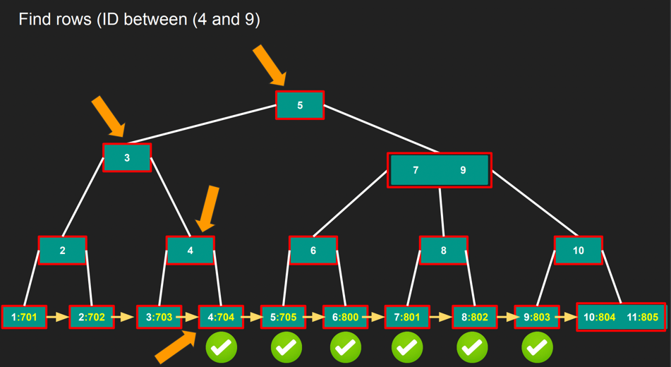

# B+ Trees

* Exactly like B Trees but only stores key in the internal nodes
* Values are stored only in leaf nodes
* Internal nodes are smaller since they only store key and can fit in more elments
* Leaf nodes are doubly linked, so once you find the key you can find all values before and after it.
 * Great for range queries
 * 
 
