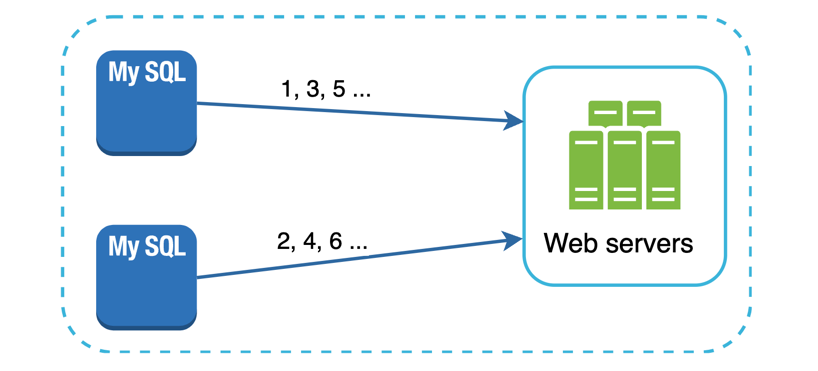
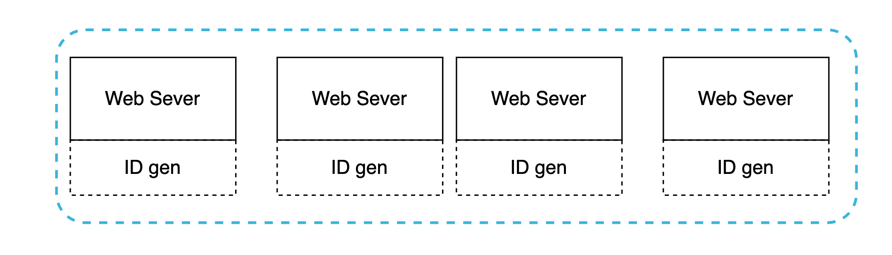
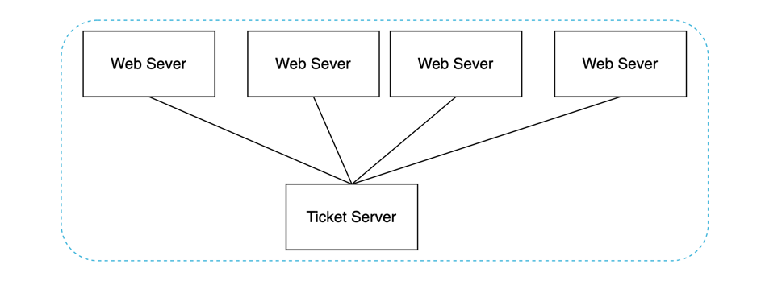
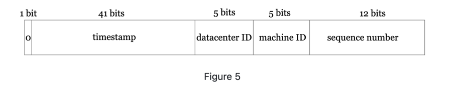

# Designing A Unique ID Generator In Distributed Systems

* The first thought would be to use a auto increment attribute in a traditional database.
* But auto incremented field doesn't work in a distributed environment.
* Because a single database server is not large enough and generating unique ids 
across multiple databases with minimal delay is challenging.

Multiple options can be used to generate unique IDs in distributed systems. The options we considered are:

1. Multi-master replication 
2. Universally unique identifier (UUID)
3. Ticket server 
4. Twitter snowflake approach

## Multi-Master Replication

> This approach uses database auto increment feature. Instead of increasing 
> the next id by 1 , we increase it by k, where k is the number of database servers
> in use. 

#### Challenges
1. Hard to scale with multiple data centers
2. IDs do not go up with time across multiple servers
3. It doesn't scale when a server is added or removed.

## UUID
> UUID is another easy way to obtain unique IDs. UUID is 128-bit number used to
> identify information in computer systems. 

#### Pros
1. UUID has very low probability of getting collision
2. From Wiki: After generating 1 billion UUIDs every second for approximately for
100 years would the probability of creating a single duplicate reach 50%

#### Cons
1. 128-bit long
2. IDs do not go up with time
3. IDs could be non-numeric

## Ticket Server
> Ticker Servers are another interesting way to generate unique IDs. 
> Flicker developed ticket servers to generate distributed primary keys.

* The idea is to use centralized auto increment feature 
is a single database server (ticket server)

Read: https://code.flickr.net/2010/02/08/ticket-servers-distributed-unique-primary-keys-on-the-cheap/

#### Pros
1. Numberic
2. Works well for small to medium applicaations.

#### Cons
1. Single point of failure, if ticketing server goes down.

## Twitter snowflake approach

* Twitter's unique id generator system called **snowflake**

* **Sign bit** : 1 bit. It will always be 0. 
This is reserved for future use. It can potentially be used to 
distinguish between signed and unsigned numbers.
* **Timestamp**: 41 bit. Milliseconds since epoch or custom epoch. 
* **Data center Id**: 5 bit, 32 DCs. 
* **Machine Id** : 5 bit
* **Sequence number** : 12 bit. For every ID generated
on that machine/process, the sequence number is incremented by 1.
The number is reset to 0 every millisecond

Read: https://blog.twitter.com/engineering/en_us/a/2010/announcing-snowflake

