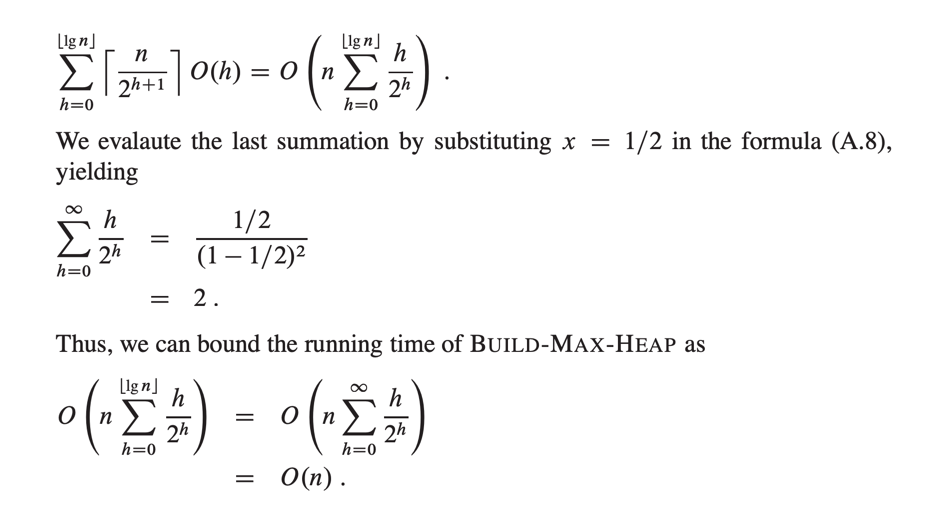
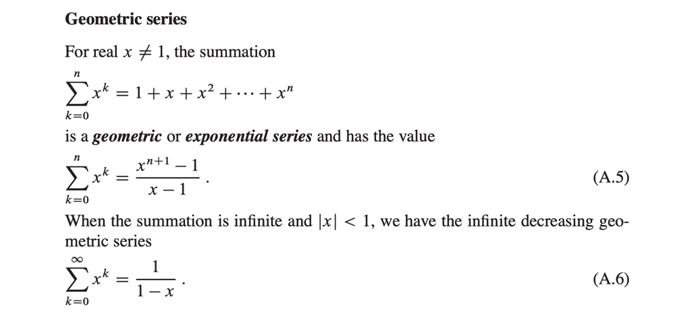
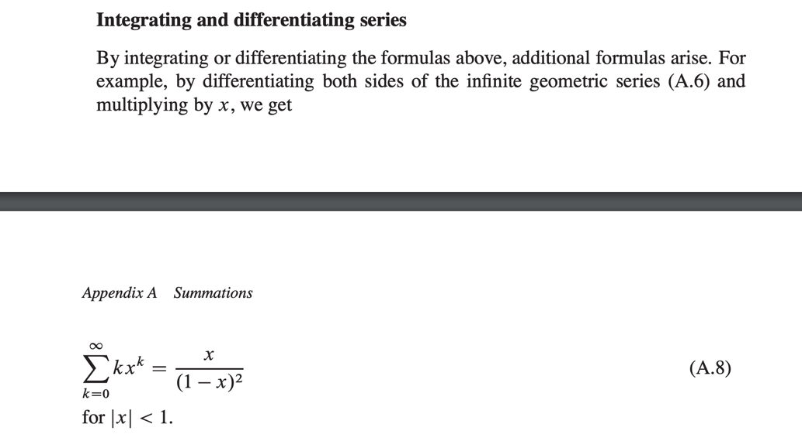

# Build Max Heap Time Complexity Analysis in Depth

* Each call to MAX-HEAPIFY takes O(log n)
* We call this for n/2 times, thus running time is O(n log n)
* This is upper bound, though correct, but it is not asymptotically tight.
* The time for Max-Heapify run at a node varies with the height of the node
  in the tree
* And hight of most nodes are small.
* Our tighter analysis relies on the properties that a n element heap has
  height floor(log n), and at most ceiling ( n / (2^h+1)) nodes of any height h
* 
* 
* 

