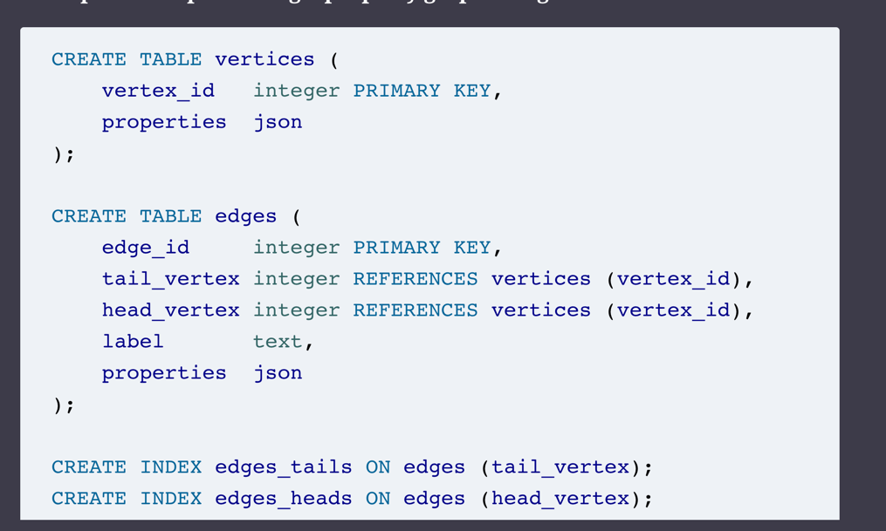

# Graph-Like Data Models

* f your application has mostly one-to-many relationships (tree-structured data)
or no relationships between records, the document model is appropriate
* But what if many-to-many relationships are very common in 
your data? The relational model can handle simple cases of many-to-many 
relationships, but as the connections within your data become more complex, 
it becomes more natural to start modeling your data as a graph
* In this section we will discuss the property graph model
  * Neo4j
  * Titan
  * InfiniteGraph
* and the triple-store model 
  * Datomic
  * AllegroGraph
* Declarative languages for graph db
  * Cypher
  * SPARQL
  * Datalog

## Property Graphs
In the property graph model, 

### Each vertex consists of:
* A unique identifier 
* A set of outgoing edges 
* A set of incoming edges 
* A collection of properties (key-value pairs)

### Each edge consists of:

* A unique identifier 
* The vertex at which the edge starts (the tail vertex)
* The vertex at which the edge ends (the head vertex)
* A label to describe the kind of relationship between the two vertices 
* A collection of properties (key-value pairs)

Graph store as consisting of two relational tables, one for vertices and one for edges

## The Cypher Query Language
Cypher is a declarative query language for property graphs, 
created for the Neo4j graph database
