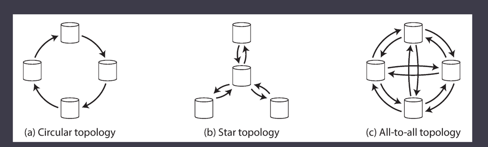

# Multi Leader Replication

## Use Cases for Multi-Leader Replication

### 1. Multi-datacenter operation
* Performance
* Tolerance of datacenter outages
* Tolerance of network problems

#### Cons
* The same data may be concurrently modified in two different 
datacenters, and those write conflicts must be resolved

### 2. Clients with offline operation
### 3. Collaborative Editing

## Handling Write Conflicts
The biggest problem with multi-leader replication is that write conflicts can occur, which means that conflict resolution is required.

There are various ways of achieving convergent conflict resolution:

Give each write a unique ID (e.g., a timestamp, a long random number, a UUID, or a hash of the 
key and value), pick the write with the highest ID as the winner, and throw away the other writes. If a timestamp is used, this technique is known as last write wins (LWW)

## Multi-Leader Replication Topologies
A Replication Topology describes the communication paths along which
write are propagated from one to another.

