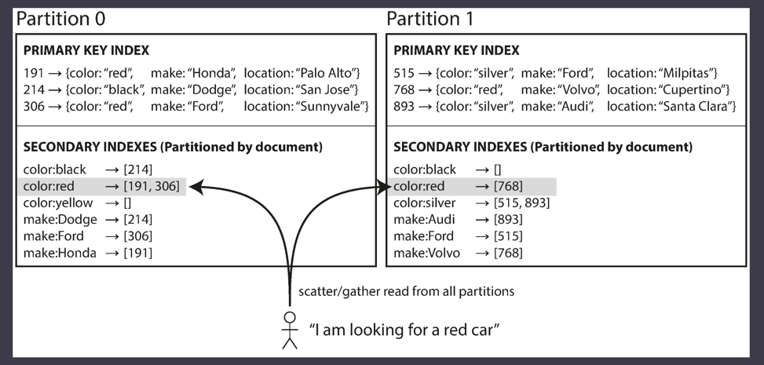

# Partitioning and Secondary Indexes

* Secondary indexes were not supported earlier due to their
added complexity.
* Secondary index doesn't map to a particular partition.
* Some like Riak started adding them as they are important in modeling.
* There are mainly two approaches to partition database based on secondary indexes
  1. Document based partitioning
  2. Term based partitioning

## Partitioning Secondary Indexes by Document

Whenever a red car is added to the database, the database partition automatically 
adds it to the list of document IDs for the index entry color:red.

In this indexing approach, each partition is completely separate: each partition
maintains its own secondary indexes, covering only the documents
in that partition

## Partitioning Secondary Indexes by Term
