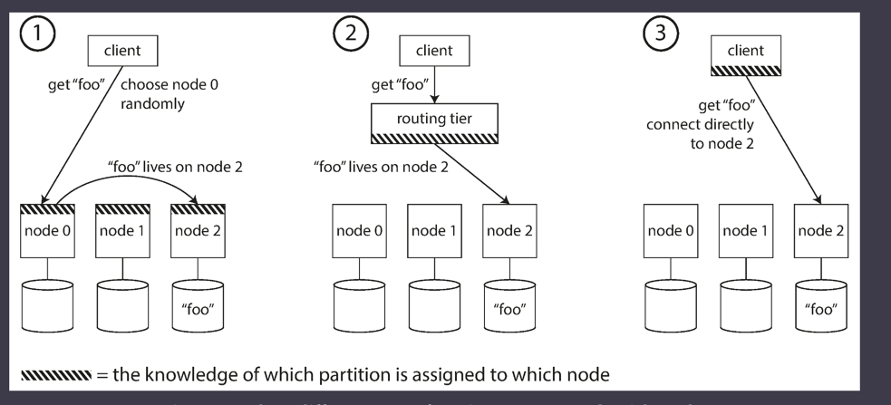

# Requests Routing

Cassandra and Riak take a different approach: 
they use a gossip protocol among the nodes to disseminate any changes in 
cluster state

Couchbase does not rebalance automatically, which simplifies the design. Normally it is configured with a routing tier called moxi, which learns about routing changes from the cluster nodes

### Parallel Query Execution

