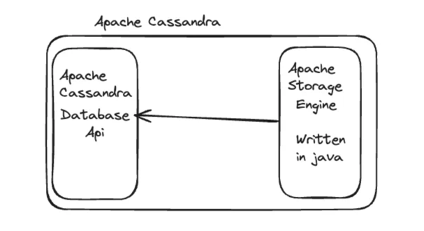
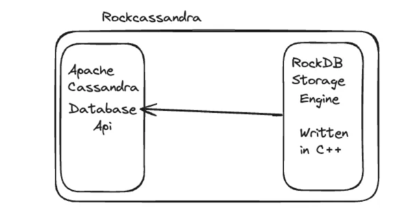

# Instagram's problems giving up on Redis for Cassandra

## Instagram has replaced redis with Apache cassandra

- Apache cassandra uses java as it backend and which is undergoing 
latency spikes too often because of garbage collection.
- Instagram just stopeed garbage collection to solve the issues

## Finding root cause with metrics
- Instagram relies heavily on Apache cassandra for key-value
storage for maintaining stringent 5-9s reliability SLA
- Client side read latency reveals an average of 5 ms and
variable p99 read latency goes to 25ms to 60ms.

## Real root cause

- They were spikes in jvm garbage collector delay. They found this
analyzing a metric called GC Stall percentage that indicated server
outages that affected cassandra's capability to serve the real
customers

The Frankenstein Solution

- Instagram mitigated the garbage collection problem by developing
their own storage engine written in C++.
- The storage engine replaced the components like memtable,
and compaction to reduce the java heap object creation and jvm
overhead.
- Using the existing storage was a more feasible and time-efficient 
solution, the uglier option to use a separate storage engine.
- They decided to use the storage engine from RocksDB to
reduce the garbage collection
- RocksDB is written in C++ and is a high-performance embedded database
optimized foe key-value.

## Results
- Rocksandra first version underwent extensive development and testing
before using it in production
- Reduced p99 to 20ms from 60ms
- 